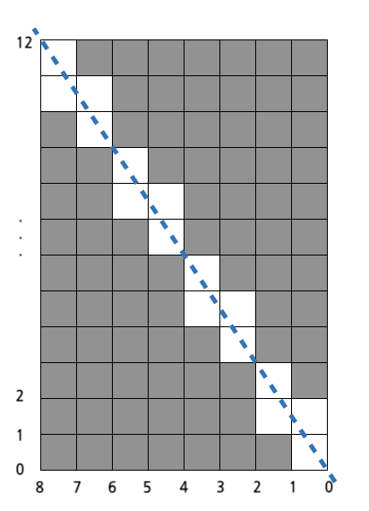

# 멀쩡한 사각형

가로 길이가 Wcm, 세로 길이가 Hcm인 직사각형 종이가 있습니다. 종이에는 가로, 세로 방향과 평행하게 격자 형태로 선이 그어져 있으며, 모든 격자칸은 1cm x 1cm 크기입니다. 이 종이를 격자 선을 따라 1cm × 1cm의 정사각형으로 잘라 사용할 예정이었는데, 누군가가 이 종이를 대각선 꼭지점 2개를 잇는 방향으로 잘라 놓았습니다. 그러므로 현재 직사각형 종이는 크기가 같은 직각삼각형 2개로 나누어진 상태입니다. 새로운 종이를 구할 수 없는 상태이기 때문에, 이 종이에서 원래 종이의 가로, 세로 방향과 평행하게 1cm × 1cm로 잘라 사용할 수 있는 만큼만 사용하기로 하였습니다.
가로의 길이 W와 세로의 길이 H가 주어질 때, 사용할 수 있는 정사각형의 개수를 구하는 solution 함수를 완성해 주세요.

### 제한사항

- W, H : 1억 이하의 자연수

### 입출력 예

|W| H   |result|
|---|-----|----|
|8|12|80|

### 입출력 예 설명

입출력 예 #1
가로가 8, 세로가 12인 직사각형을 대각선 방향으로 자르면 총 16개 정사각형을 사용할 수 없게 됩니다. 원래 직사각형에서는 96개의 정사각형을 만들 수 있었으므로, 96 - 16 = 80 을 반환합니다.

### 구현

사각형의 기울기를 고려해서 좌표계산하는 문제인 것 같다..

우선 이미지를 참조해보면



2사분면으로 향하는 일차함수의 그래프를 생각할 수 있고 이 때 가로의 길이가 $w$로, 세로의 길이가 $h$로 주어졌기 때문에 

$y=\frac{h}{w}x$ 과 같은 일차함수의 기울기를 구하는 식을 얻어낼 수 있다.

이를 응용하면 될 것으로 생각한다.

청색 파선을 $y=\frac{12}{8}x$ 라는 함수의 그래프로 생각했을 때 $x$에 0부터 11까지 대입하게 되면 

- $x = 0$ 일 때 0개
- $x = 1$ 일 때 1.xxx ===> 1개
- $x = 2$ 일 때 3개
- $x = 3$ 일 때 4.xxx ===> 4개
- $x = 4$ 일 때 6개
- $x = 5$ 일 때 7.xxx ===> 7개
- $x = 6$ 일 때 9개
- $x = 7$ 일 때 10.xxx ===> 10개

이므로 $x$가 0부터 7일때까지 모두 더한 값에 대칭관계이므로 2를 곱해주면 정답이 나오게 된다.


```java
class Solution {
    public long solution(long w, long h) {
        long answer = 0;

        for(int i = 0; i < w; i++) {
            answer += (h * i) / w;
        }

        return answer * 2;
    }
}
```